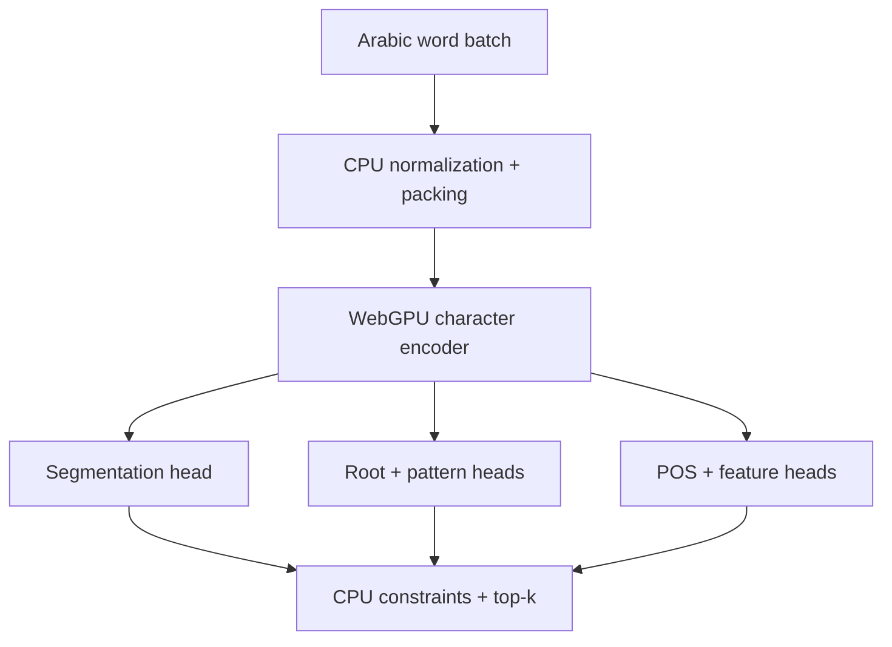

# TinySarf: WebGPU engineering blueprint

**Version:** 2.0  
**Date:** 11 September 2026  
**Status:** Build specification  
**Inspiration:** [Vercel Labs `gpu-lexer`](https://github.com/vercel-labs/gpu-lexer)

## 1. Project statement

Build a tiny learned morphological analyzer for Modern Standard Arabic that runs locally in the browser through WebGPU. It accepts an Arabic word or a batch of words and returns morpheme spans, root, pattern, part of speech, and core morphological features without a server-side inference call.

The task is established; the engineering result is the novelty:

- A small purpose-built learned model rather than a general LLM.
- A custom or tightly controlled WebGPU inference path.
- A minimal TypeScript package with one primary function.
- Reproducible teacher-data generation, training, quantization, evaluation, promotion, and release.
- Published accuracy, size, browser-performance, parity, and limitation numbers that are generated from frozen artifacts.

The project is successful only when another developer can install it easily and independently reproduce the published claims.

## 2. What “follow the Vercel project” means

TinySarf should reproduce the engineering discipline and deliverables of `gpu-lexer`, not its syntax-highlighting labels.

`gpu-lexer` currently publishes:

- One narrow public function and a small structured result.
- A WebGPU runtime that keeps its device, pipelines, weights, and buffers resident.
- An offline teacher-labelled training pipeline.
- A tracked promoted checkpoint.
- Separate `core`, `training`, and `benchmark` packages.
- A README, architecture document, model card, license, and third-party notices.
- Correctness, size, and real-browser performance benchmarks.
- Published checkpoint identity, parameter/weight counts, compressed package size, evaluation-set counts, accuracy, macro-F1, limitations, and reproducibility details.
- Promotion guards that compare a candidate with the fixed active model on untouched verification data.

TinySarf must ship the same categories of evidence. It must not copy Vercel's published numbers or present planned targets as results.

## 3. Non-negotiable requirements

1. **WebGPU is required.** The promoted browser package must contain and exercise a WebGPU inference path in a secure browser context.
2. **A CPU reference is also required.** It exists for correctness and parity testing; WASM may be a supported fallback.
3. **No runtime server inference.** Model execution happens on the client.
4. **One small public API.** Internal complexity is not exposed to users.
5. **Top-k and ambiguity are explicit.** Undiacritized Arabic does not always have one unique analysis.
6. **Every public number is reproducible.** Numbers come from versioned JSON artifacts, never manual editing.
7. **Model promotion is guarded.** A candidate cannot become active merely because one aggregate metric improved.
8. **Teacher agreement is not called ground truth.** Independent human-labelled evaluation is reported separately.
9. **Cold and warm performance are different claims.** Both are measured.
10. **Model, runtime, and total package size are reported separately.**

## 4. Public API and output contract

Mirror the simplicity of Vercel's `parse(code)` interface:

```ts
import { analyze } from "tinysarf";

const analyses = await analyze("وبكتابهم");
```

The default call returns the highest-ranked analysis. `topK` exposes ambiguity.

```ts
const analyses = await analyze("وبكتابهم", { topK: 3 });
```

### Required output

The segmentation output deliberately uses Vercel-style non-overlapping spans:

```ts
type MorphSpanType =
  | "conjunction"
  | "particle"
  | "preposition"
  | "article"
  | "stem"
  | "derivational_suffix"
  | "inflectional_suffix"
  | "pronominal_enclitic";

interface MorphSpan {
  type: MorphSpanType;
  start: number;
  end: number;
}

interface MorphAnalysis {
  spans: MorphSpan[];
  root: string | null;
  pattern: string | null;
  lemma?: string | null;
  pos: string;
  features: {
    person?: string;
    gender?: string;
    number?: string;
    aspect?: string;
    mood?: string;
    voice?: string;
    case?: string;
    state?: string;
  };
  score: number;
}
```

Example:

```json
[
  {
    "spans": [
      { "type": "conjunction", "start": 0, "end": 1 },
      { "type": "preposition", "start": 1, "end": 2 },
      { "type": "stem", "start": 2, "end": 6 },
      { "type": "pronominal_enclitic", "start": 6, "end": 8 }
    ],
    "root": "كتب",
    "pattern": "فعال",
    "lemma": "كتاب",
    "pos": "noun",
    "features": {
      "gender": "masculine",
      "number": "singular",
      "state": "construct"
    },
    "score": 0.91
  }
]
```

### Contract rules

- `start` and `end` are UTF-16 code-unit offsets, matching JavaScript slicing.
- Spans are ordered, non-overlapping, valid, and cover the complete normalized word except ignored combining marks defined by the normalization contract.
- The original input and normalization behavior are documented.
- `score` is a ranking score until calibration validates probability semantics.
- Missing, unknown, and not-applicable values are distinct internally; the public schema must document how each is serialized.
- All output labels have a fixed order recorded in the checkpoint manifest.
- The package keeps WebGPU resources resident after the first call.
- Calls are scheduled through one internal runtime so a one-function API does not imply reinitialization.
- A batch API is provided because WebGPU should be most useful for many words:

```ts
const results = await analyze.batch(words, { topK: 3 });
```

## 5. Intended use and non-goals

### Intended use

- Experimental client-side morphological analysis of MSA words.
- Educational and research tools.
- Search/indexing enrichment where errors are acceptable.
- Privacy-sensitive local processing.
- Large browser-side batches where WebGPU parallelism is valuable.

### Not suitable for

- Religious, legal, medical, security, or access-control decisions.
- Automatic grading without human review.
- Full syntactic parsing.
- Guaranteed linguistic correctness for isolated undiacritized words.
- Dialectal Arabic in the first release.
- Replacing a mature server-side analyzer when exhaustive lexicon coverage is required.

## 6. Model and runtime architecture



### CPU preparation

The CPU performs a deterministic mechanical pass:

1. Validate and normalize the input under a versioned Unicode contract.
2. Retain a mapping from normalized positions to original UTF-16 offsets.
3. Encode characters from a fixed Arabic vocabulary.
4. Pack character id, position, diacritic flags, character shape, and boundary flags into compact `u32` values.
5. Pad batches to size classes rather than arbitrary lengths to keep GPU shapes predictable.

Do not embed a full morphological dictionary in the first core package unless evaluation proves it necessary.

### Learned WebGPU path

Recommended first architecture:

- Character embedding width: 32 or 48.
- Two or three local depthwise/pointwise convolution blocks.
- Bidirectional affine scan or another parallelizable context mechanism.
- Pooled word representation plus per-character states.
- Segmentation logits for every character.
- Fixed classification heads for POS and inflectional features.
- Three- or four-position radical head over Arabic letters plus blank.
- Closed pattern head for common patterns plus unknown.
- Optional lemma transduction only after the core output is stable.

Why this shape:

- It is substantially smaller than an LLM.
- It exposes parallel operations that map naturally to WGSL compute kernels.
- It avoids an autoregressive loop for most outputs.
- Root output has a fixed maximum length, which simplifies GPU execution.

### WebGPU runtime requirements

- Generate WGSL from promoted model metadata where practical.
- Create device, pipelines, weights, and grow-only buffers once.
- Reuse all resources across calls.
- Use static tensor layouts and explicit alignment.
- Quantize weights to int8 first; consider int6/int4 only after correctness and performance are stable.
- Pack output labels/logits to minimize readback.
- Return only information needed for postprocessing.
- Handle device loss and failed adapter acquisition with a clear error or WASM fallback.
- Never silently execute remotely.
- Keep a debug mode that exposes phase timings and parity tensors without shipping it in the production entry point.

### Reference runtime

Implement a simple CPU/Python reference for every operation before writing WGSL. Optionally provide a WASM browser fallback. The reference defines semantics; WebGPU must match it within a documented tolerance.

### Postprocessing

The CPU:

- Decodes boundary tags to spans.
- Maps normalized offsets back to the original input.
- Applies hard compatibility constraints.
- Combines head outputs into valid candidate analyses.
- Produces top-k candidates.
- Applies calibration/abstention.

## 7. Data and supervision

Use [CAMELMORPH MSA](https://github.com/CAMeL-Lab/camel_morph) and [CAMeL Tools](https://github.com/CAMeL-Lab/camel_tools) as the initial offline teacher. Pin exact releases and verify every license. The CAMELMORPH repository currently describes its data as CC BY 4.0 and code as MIT.

### Required manifests

`packages/training/data/corpus.json` must list:

- Source name and purpose.
- Exact version, commit, or release.
- Download/build instructions.
- License and attribution.
- SHA-256 checksum when possible.
- Which split receives each source.
- Whether labels are teacher-generated or human-created.

Generated datasets and downloaded databases do not need to be committed. The pinned manifest and compiler must reconstruct them.

### Split contract

Create four disjoint roles:

1. **Training:** optimization only.
2. **Verification:** repeated model selection and promotion.
3. **Mining:** error discovery and failure-bank collection; never used for the published verification score.
4. **Final test:** opened only for release candidates and reported separately.

Prevent leakage by grouping related forms. At minimum, lemma families must not cross train/verification/final-test boundaries. Prefer root-family-disjoint challenge sets in addition to a natural-distribution split.

### Evaluation sets

Maintain:

- `teacher-natural`: natural teacher-labelled distribution.
- `gold-natural`: independently human-labelled natural sample.
- `gold-balanced`: balanced difficult phenomena.
- `unseen-lemma` and `unseen-root` subsets.
- `weak-root`, `hamzated`, `doubled`, `quadriliteral`, `broken-plural`, `clitic-stack`, `diacritized`, `named-entity`, `foreign`, `malformed`, and `non-MSA` slices.
- Website/example words reserved from training and included in verification.

### Label policy

- Publish a versioned mapping from CAMeL fields to TinySarf labels.
- Record every dropped or merged feature.
- Preserve genuine ambiguity rather than arbitrarily selecting the first teacher analysis.
- Report teacher agreement as agreement, not objective accuracy.
- Manually audit a random sample and every diagnostic slice before training at scale.

## 8. Repository structure

Mirror `gpu-lexer` closely:

```text
tinysarf/
├── .github/workflows/
├── apps/
│   └── website/                  # small playground and published result tables
├── packages/
│   ├── core/                     # npm package, CPU preparation, WGSL runtime
│   │   ├── src/
│   │   ├── test/
│   │   └── scripts/check-package.ts
│   ├── training/                 # data, PyTorch, evaluation, promotion
│   │   ├── data/corpus.json
│   │   ├── active/               # promoted float + deployed checkpoint
│   │   ├── runs/                 # ignored local runs
│   │   ├── failures/             # small reviewed replay bank
│   │   └── src/
│   └── benchmark/                # correctness, size, browser performance
│       ├── browser/
│       ├── results/              # immutable release JSON
│       ├── src/
│       └── test/
├── README.md
├── MODEL_CARD.md
├── architecture.md
├── THIRD_PARTY_NOTICES.md
├── LICENSE
├── package.json
├── pnpm-lock.yaml
└── pnpm-workspace.yaml
```

### Root scripts

Provide commands analogous to Vercel's:

```json
{
  "scripts": {
    "test": "run all unit, parity, benchmark-schema, and website type checks",
    "test:core": "test the public contract and WebGPU-independent logic",
    "test:training": "test data mapping, splits, metrics, export, and promotion",
    "test:benchmark": "test benchmark math and result schemas",
    "build:core": "build the publishable package",
    "check:package": "verify exports, files, hashes, and size budgets",
    "train": "train from the current promoted checkpoint or from scratch",
    "fine-tune": "add a reviewed failure and run guarded fine-tuning",
    "evaluate": "evaluate float and deployed checkpoints",
    "model:promote": "validate and atomically promote an eligible run",
    "benchmark": "run correctness, size, and browser benchmarks",
    "benchmark:correctness": "produce frozen correctness JSON",
    "benchmark:size": "produce raw/minified/gzip/Brotli size JSON",
    "benchmark:browser": "run the real-browser performance harness"
  }
}
```

## 9. Agent execution instructions

The following section is a binding brief for any coding or worker agent implementing the project.

### General rules

1. Never invent a result, device detail, corpus count, or benchmark number.
2. Write `TBD — not measured` until a command has produced the value.
3. Save raw machine-readable results before writing prose.
4. Every result file records Git commit, dirty-worktree state, model id, dataset digest, date, commands, OS, browser version, WebGPU adapter, and runtime versions.
5. Do not tune on the final-test set.
6. Do not delete a bad run. Mark it ineligible and retain its reason.
7. Do not promote by manually copying weights. Use the promotion command.
8. Do not compare methods on different input samples or normalization contracts.
9. Measure end-to-end public API time as the canonical performance result.
10. Report negative findings, including cases where WebGPU is slower.

### Implementation order

The agent must work in this sequence:

1. Freeze the TypeScript schema and 50 hand-checked fixtures.
2. Build the teacher adapter and split manifest.
3. Implement metric functions with small known-answer tests.
4. Implement a float CPU/Python reference model.
5. Train 50K, 100K, and 250K parameter candidates.
6. Freeze the first verification set before architecture tuning.
7. Export the chosen model and verify reference parity.
8. Quantize to int8 and record accuracy deltas.
9. Implement the WebGPU runtime operation by operation.
10. Add tensor-level and end-to-end WebGPU parity tests.
11. Build the browser benchmark harness.
12. Add promotion gates.
13. Generate README/model-card numbers from release JSON.
14. Publish only after a clean-clone reproduction succeeds.

### Definition of “done” for each change

A change is not complete until:

- Tests exist for the new behavior.
- The public schema remains valid or is deliberately versioned.
- CPU reference and WebGPU outputs are compared.
- Relevant diagnostic slices are re-evaluated.
- Size and latency regressions are measured when runtime code changes.
- The run/config/result artifacts are saved.
- Documentation describes any new limitation.

## 10. Correctness measurement protocol

### Unit of evaluation

Evaluate one orthographic word with its complete set of valid analyses. Do not score a prediction wrong merely because it selected a different valid analysis that the simplified gold file omitted.

### Required metrics

Publish:

- Segmentation exact match.
- Boundary precision, recall, and F1.
- Span-type macro-F1 and per-class precision/recall/F1/support.
- Root exact match.
- Root character accuracy as a secondary diagnostic.
- Pattern exact match.
- Lemma exact match if lemma is in the release contract.
- POS accuracy and macro-F1.
- Per-feature accuracy and macro-F1.
- Full-analysis exact match.
- Top-1 and top-3 full-analysis recall.
- Coverage at the abstention threshold.
- Risk/error among non-abstained predictions.
- Expected calibration error and Brier score only if scores are called probabilities.
- Confusion matrices for segmentation types, POS, and important closed features.

### Mandatory breakdowns

Report all major metrics for:

- Teacher-natural verification.
- Independent gold-natural test.
- Gold-balanced challenges.
- Seen versus unseen lemma.
- Seen versus unseen root.
- Every hard linguistic slice.
- Diacritized versus undiacritized input.
- Word-length buckets.
- Ambiguity-count buckets.

### Statistical reporting

- Report numerator, denominator, and percentage.
- Use bootstrap 95% confidence intervals at the word level for headline metrics.
- For candidate-versus-active comparisons, use paired bootstrap differences on the same examples.
- Round only in the rendered table; retain full precision in JSON.
- State the bootstrap seed and number of resamples.
- Never infer significance from overlapping/non-overlapping individual confidence intervals; compute the paired difference directly.

### Teacher versus gold

Keep two headings:

- **Teacher agreement:** how closely the model approximates CAMELMORPH/CAMeL Tools.
- **Gold accuracy:** performance against independent human annotation.

Never substitute one for the other.

## 11. WebGPU parity and validation protocol

Run the same frozen inputs through:

1. PyTorch float reference.
2. Exported float CPU runtime.
3. Quantized CPU reference.
4. Quantized WebGPU runtime.

For every stage record:

- Maximum absolute and relative logit difference by tensor/head.
- Percentage of identical argmax labels.
- Percentage of identical complete outputs.
- Count and saved examples for every disagreement.
- NaN/Infinity checks.
- Results for minimum, maximum, and irregular batch/length shapes.

### Initial parity gates

- Float export versus PyTorch: maximum absolute error ≤ `1e-4`, unless an operation-specific documented tolerance is justified.
- CPU quantized versus WebGPU quantized: ≥ 99.99% head-level argmax agreement on the parity corpus.
- No malformed spans, invalid offsets, NaNs, buffer overruns, or nondeterministic output in 100 repeated warm runs.
- Every disagreement is stored in a parity failure file.

These are starting gates, not published achievements. Change a gate only through a reviewed configuration change with justification.

### Browser validation

Test at least:

- Chrome/Chromium stable on one discrete GPU.
- Chrome/Chromium stable on one integrated GPU.
- Chrome Android when hardware is available.
- Safari and Firefox when their stable versions expose the required WebGPU behavior.
- WebGPU unavailable, adapter request failure, device loss, and worker failure paths.

WebGPU requires a secure context in normal deployment. The package must fail clearly or use the documented fallback.

## 12. Browser performance protocol

### Principle

The canonical number is wall-clock time observed by a consumer calling the public API. GPU timestamp queries are optional diagnostics and must not replace end-to-end measurements.

### Workloads

Freeze a `performance-corpus.json` containing real MSA words and hashes. Include:

- Single short word: 3–5 characters.
- Single median word.
- Single long/clitic-rich word.
- Batches of 8, 32, 128, 512, and 2,048 words.
- Uniform-length and mixed-length batches.
- Natural corpus batch.
- Maximum supported length and batch.

Do not select performance inputs based on favorable results.

### Phases to measure

Instrument separate marks for:

1. Module import.
2. Adapter/device acquisition.
3. Shader compilation and pipeline creation.
4. Weight decode and GPU upload.
5. CPU normalization/feature packing.
6. Input buffer upload.
7. Command encoding/submission.
8. GPU execution plus queue wait.
9. Readback/map synchronization.
10. CPU decoding/constraint/postprocessing.
11. Complete public API call.

The published headline remains total public API latency. Phase data explains bottlenecks.

### Cold benchmark

- Launch a fresh browser context/page for every measured cold run.
- Disable service-worker/application caches or explicitly label cache state.
- Perform at least 20 independent cold runs per device/browser.
- Report median, p95, minimum, maximum, and sample count.
- Report cold network transfer separately from cached initialization.
- Record whether shader compilation is included; default is yes.

### Warm benchmark

- Initialize the package once.
- Run at least 20 unmeasured warmups for each shape until timing stabilizes.
- Run at least 100 measured iterations per shape.
- Randomize workload order or rotate shapes to reduce thermal/order bias.
- Do not run DevTools while collecting release numbers.
- Report p50, p95, mean, standard deviation, and sample count; use p50/p95 as headlines.
- Repeat the entire benchmark at least three times and retain all raw samples.

### Throughput benchmark

- Measure words/second and characters/second for batch workloads.
- Use total API time, including packing and postprocessing.
- Report batch size and padding waste.
- Verify output hashes so optimized runs cannot skip work.

### CPU/WASM comparison

Run the same public inputs and output contract through the reference/fallback backend. Report:

- WebGPU and CPU/WASM cold time.
- WebGPU and CPU/WASM warm p50/p95.
- Speedup `CPU time / WebGPU time`.
- The crossover batch size where WebGPU becomes faster.

If WebGPU loses for one-word inference, say so. WebGPU support remains a project feature; speed claims are limited to workloads where measured.

### Browser/hardware record

Every performance result must include:

- Device model.
- OS and version.
- Browser and full version.
- `navigator.userAgent` or equivalent metadata.
- WebGPU adapter description/vendor/architecture when exposed.
- Power state if known and whether plugged in.
- CPU model and RAM if known.
- Screen/background-tab state.
- Model id, format, quantization, batch, length bucket.
- Git commit and dirty status.

### Memory

- Record JS heap when the browser exposes it.
- Record `measureUserAgentSpecificMemory` only where supported and label it experimental.
- Track allocated GPU buffer bytes exactly from runtime metadata.
- Report peak allocated GPU bytes and steady-state resident buffer bytes.
- Do not publish cross-browser memory comparisons using incomparable APIs.

## 13. Size measurement protocol

The size script must build the exact npm tarball and report:

- Training parameter count.
- Reachable deployed weight count.
- Packed weight bytes.
- WGSL source bytes.
- JavaScript raw and minified bytes.
- Model/metadata raw bytes.
- Complete npm package/tarball bytes.
- Gzip and Brotli bytes for the public browser entry.
- WASM fallback bytes, if included.
- Total first-load transfer for WebGPU and fallback paths.

Rules:

- Use fixed compression levels and record tool versions.
- Measure generated production files, not source estimates.
- Fail CI when the package exceeds the current budget.
- Keep a size history keyed by release/model id.
- Explain any increase over 5%.

Initial targets—not results:

- Deployed weights under 1 MiB.
- Complete WebGPU package under 1.5 MiB Brotli.
- Core wrapper plus shader under 100 KiB Brotli, excluding weights.

After the first working version, tighten targets based on real measurements.

## 14. Benchmark result schema

Every release benchmark writes immutable JSON, for example:

```json
{
  "schemaVersion": 1,
  "runId": "20260911T120000.000Z",
  "git": { "commit": "TBD", "dirty": false },
  "model": {
    "id": "TBD",
    "format": "TBD",
    "quantization": "int8",
    "trainingParameters": null,
    "reachableWeights": null
  },
  "data": {
    "verificationDigest": "TBD",
    "goldDigest": "TBD"
  },
  "correctness": {
    "teacherAgreement": null,
    "segmentationExactMatch": null,
    "rootExactMatch": null,
    "fullAnalysisTop1": null,
    "fullAnalysisTop3": null
  },
  "size": {
    "packedWeightsBytes": null,
    "minifiedPackageBytes": null,
    "brotliPackageBytes": null
  },
  "browser": [],
  "commands": [],
  "createdAt": "TBD"
}
```

`null` means unmeasured. Zero means measured zero. Never use zero as a placeholder.

## 15. Model promotion contract

A candidate is eligible only if all checks pass:

### Integrity

- Model, feature, label, normalization, and result schemas validate.
- Tensor names, shapes, offsets, scales, packed lengths, and class order match metadata.
- Checkpoint and dataset hashes match.
- Clean build and tests pass.

### Correctness

- Candidate and active model are evaluated on the exact same frozen verification examples.
- Primary composite score improves or meets the explicitly configured release rule.
- No headline metric crosses a minimum floor.
- No protected diagnostic slice regresses more than its allowed delta.
- Top-3 recall does not improve by sacrificing unacceptable top-1 quality.
- Calibration/abstention remains within configured limits.

Suggested composite for selection only:

```text
0.30 segmentation exact match
+ 0.25 root exact match
+ 0.15 POS macro-F1
+ 0.15 feature macro-F1
+ 0.15 top-3 full-analysis recall
```

The component metrics must still be published. A composite must not hide a serious regression.

### Deployment parity

- Quantized WebGPU output passes parity gates.
- Browser contract fixtures pass.
- 100 repeated warm runs are deterministic.
- Maximum length/batch and empty/invalid input tests pass.

### Engineering budgets

- Weight and package size are inside limits.
- Warm performance does not regress by more than the configured tolerance on the reference benchmark device.
- Cold initialization and memory do not exceed their floors.

### Promotion operation

Promotion must:

1. Re-run active and candidate evaluation.
2. Write a signed/hashed eligibility report.
3. Copy float and deployed checkpoints atomically into `packages/training/active/`.
4. Regenerate runtime metadata, shader constants, and model-card result tables.
5. Run clean package, parity, size, and browser smoke tests.
6. Refuse promotion if the working tree or result provenance is unclear.

## 16. Model card specification

Create `MODEL_CARD.md` with this exact structure. Populate numeric fields from a release JSON generator. Until measured, show `TBD — not measured`.

### Model

- Public package version.
- Promoted checkpoint id and timestamp.
- Model format/architecture name.
- Training parameter count.
- Reachable browser weight count.
- Quantization scheme and packed bytes.
- JavaScript/shader/model/package raw, minified, gzip, and Brotli sizes.
- Input contract and public output labels/features.

### Intended use

- Supported language variety and input type.
- Appropriate applications.
- Explicit prohibited/high-risk uses.

### Training data

- Teacher and human-labelled sources.
- Exact pinned manifest path.
- License summary and attribution.
- Train/verification/mining/final-test separation.
- Number of words, unique surfaces, analyses, roots, lemmas, and supervised characters.
- Ambiguity distribution.
- Whether generated corpora are distributed or reconstructed.

### Training procedure

- Architecture and objective.
- Distillation/teacher mapping.
- Sampling, balancing, curriculum, and failure replay.
- Optimizer, seed, epochs/steps, early stopping.
- Quantization and any QAT.
- Hardware and software versions.

### Evaluation

- Exact evaluation contract and normalization version.
- Teacher agreement table.
- Independent gold table.
- Headline metrics with numerator/denominator and 95% CI.
- Per-feature and per-slice results.
- Float versus quantized delta.
- CPU versus WebGPU parity.
- Dataset sizes and digests.

### Browser performance

- Device/browser table.
- Cold p50/p95.
- Warm p50/p95 for single word and batches.
- Throughput.
- WebGPU-versus-WASM crossover batch.
- GPU buffers and memory where measurable.
- Exact benchmark command and result artifact.

### Limitations

- Isolated-word ambiguity.
- Teacher/annotation errors.
- Weak/unseen-root behavior.
- Domain and MSA-only limits.
- Diacritics and spelling variants.
- Calibration limits.
- Browser/WebGPU differences.
- Cold-start and small-input overhead.
- Quantization differences.

### Reproducibility

- Active checkpoint location.
- Manifest/dataset reconstruction command.
- Training command.
- Evaluation command.
- Browser benchmark command.
- Promotion rules.
- Git commit and all artifact hashes.

### Ethical and licensing notes

- Data/model licenses.
- Attribution obligations.
- Privacy benefit of local inference.
- Potential downstream harms from incorrect morphology.

## 17. Published README numbers

The README may show only a compact set copied automatically from the current model card:

- Checkpoint id.
- Reachable deployed weights.
- Brotli package size.
- Teacher segmentation agreement.
- Gold segmentation exact match.
- Gold root exact match.
- Gold top-3 full-analysis recall.
- Verification/gold sample counts.
- One reference-device warm batch throughput.

Every README number links to the model card and includes the result artifact id. Never show only the strongest slice.

## 18. Success criteria

### Minimum technical success

- WebGPU inference works entirely in-browser.
- Public output conforms to the span contract and contains root/POS/features.
- The quantized WebGPU runtime passes parity validation.
- Model weights are below 1 MiB.
- Independent gold results are clearly above rules/frequency baselines.
- Batch inference shows a measured WebGPU advantage on at least one common workload.
- Package, model card, architecture document, benchmark harness, and third-party notices are public.

### Strong success

- Strong segmentation and useful root accuracy on lemma-disjoint gold data.
- Top-3 output handles genuine ambiguity well.
- WebGPU wins at a practical batch size, not only an artificial huge input.
- Clean install and first analysis require fewer than ten lines of application code.
- A clean clone reproduces published correctness and size results.
- External users can submit failure cases that enter a guarded replay bank.

### Reasons to pivot

- Root generalization remains poor despite constrained output.
- A large dictionary is required, eliminating the size advantage.
- WebGPU runtime complexity provides no useful batch-performance benefit.
- Independent gold accuracy is far below teacher agreement.

A hybrid rule/model system is an acceptable outcome if it meets the same browser, evidence, and packaging standards.

## 19. Milestones

### M0 — Contract and fixtures

- Freeze schema, offsets, normalization, and 50 reviewed examples.
- Implement validators for spans and feature bundles.

### M1 — Data compiler and baselines

- Pin CAMELMORPH/CAMeL Tools.
- Build disjoint manifests and hard slices.
- Implement rule/frequency baselines.

### M2 — Float student

- Compare 50K/100K/250K CNN or affine-scan models.
- Freeze verification before extensive tuning.

### M3 — Quantized reference

- Export and quantize to int8.
- Measure float-to-quantized loss by field and slice.

### M4 — WebGPU runtime

- Implement WGSL kernels incrementally.
- Pass tensor and full-output parity.
- Reuse device, pipelines, weights, and buffers.

### M5 — Benchmark and promotion

- Build correctness, size, and real-browser harnesses.
- Implement candidate-versus-active promotion guards.

### M6 — Public package

- Publish npm package, active checkpoint, README, architecture, model card, notices, and immutable result JSON.
- Keep the website small: input, output inspection, limitations, and generated benchmark tables.

## 20. First experiment

Before optimizing WGSL, test the scientific premise:

> Can a model below 250K parameters achieve useful segmentation, root, POS, and feature performance on lemma-disjoint MSA data and remain below 1 MiB after int8 quantization?

Then test the engineering premise:

> Can the quantized model execute through WebGPU with reference parity, and at what batch size does it beat the CPU/WASM implementation end to end?

Both answers must be published even if one is negative.

## 21. Sources to keep beside the implementation

- [`gpu-lexer` repository](https://github.com/vercel-labs/gpu-lexer)
- [`gpu-lexer` model card](https://github.com/vercel-labs/gpu-lexer/blob/main/MODEL_CARD.md)
- [`gpu-lexer` architecture](https://github.com/vercel-labs/gpu-lexer/blob/main/architecture.md)
- [`gpu-lexer` benchmark package](https://github.com/vercel-labs/gpu-lexer/tree/main/packages/benchmark)
- [CAMELMORPH](https://github.com/CAMeL-Lab/camel_morph)
- [CAMeL Tools](https://github.com/CAMeL-Lab/camel_tools)
- [CAMeL morphology features](https://camel-tools.readthedocs.io/en/latest/reference/camel_morphology_features.html)
- [Camel Morph MSA paper](https://aclanthology.org/2024.lrec-main.240/)
- [WebGPU API](https://developer.mozilla.org/en-US/docs/Web/API/WebGPU_API)
- [ONNX Runtime WebGPU](https://onnxruntime.ai/docs/tutorials/web/ep-webgpu.html)

## Final direction

TinySarf should be the Arabic-morphology counterpart to `gpu-lexer` in engineering style: a narrow API, a tiny learned model, a real WebGPU runtime, offline teacher supervision, a tracked promoted checkpoint, separate training/core/benchmark packages, and unusually honest published evidence. The defining result is not merely that a shader runs. It is that every accuracy, size, parity, and performance claim can be traced to a frozen dataset, checkpoint, browser run, and machine-readable artifact.
